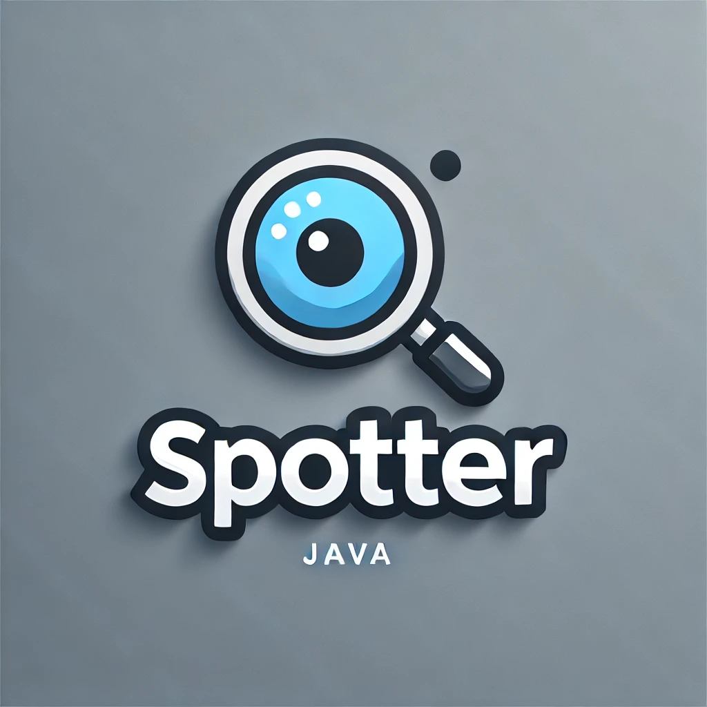

[](https://jitpack.io/#tomekbielaszewski/spotter)



Spotter library provides mouse and keyboard automation based on the classic `java.awt.Robot`, with the added capability of 
image recognition.  

It allows you to search for specific images on the screen and interact with them using mouse and 
keyboard events. The library also supports waiting for images to appear before proceeding. Its image recognition 
algorithms are simple, utilizing pixel-by-pixel comparison and color-map reversed indexing.

## Installation

All versions are listed on [jitpack](https://jitpack.io/#tomekbielaszewski/spotter)

### Maven

```xml
	<repositories>
		<repository>
		    <id>jitpack.io</id>
		    <url>https://jitpack.io</url>
		</repository>
	</repositories>
```

```xml
	<dependency>
	    <groupId>com.github.tomekbielaszewski</groupId>
	    <artifactId>spotter</artifactId>
	    <version>master-SNAPSHOT</version>
	</dependency>
```

### Gradle

```groovy
	dependencyResolutionManagement {
		repositoriesMode.set(RepositoriesMode.FAIL_ON_PROJECT_REPOS)
		repositories {
			mavenCentral()
			maven { url 'https://jitpack.io' }
		}
	}
```

```groovy
	dependencies {
	        implementation 'com.github.tomekbielaszewski:spotter:master-SNAPSHOT'
	}
```

## Image locator - debug image finding

Two environment variables are used for image finding debugging:

`SPOTTER_DEBUG_ENABLED=false`  
`SPOTTER_DEBUG_DIRECTORY=visual-debug/` - relative directory path to store step-by-step images as the ImageLocator searches the `Icon` on the screenshot made by `Spotter`

## New development release

Each commit is built on dedicated jitpack page and released as one of the versions there

https://jitpack.io/#tomekbielaszewski/spotter

If the build is not triggered automatically - the button "Get it" will trigger it - logs should start to show progress then.

## New production release

Tagging the commit will trigger production release on jitpack.io
